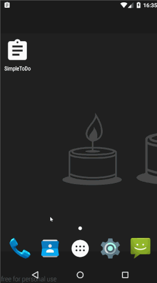

# SimpleToDo
A simple todo list app provides these functions:
  - Add new items with title, priority, note, due date/time, notification.
  - Edit items by clicking the item in the list
  - Delete items (sliding item left would show the delete button)
  - Clear all items (menu option at the top right corner)
  - Clicking the notification will direct the user back to the app
   

